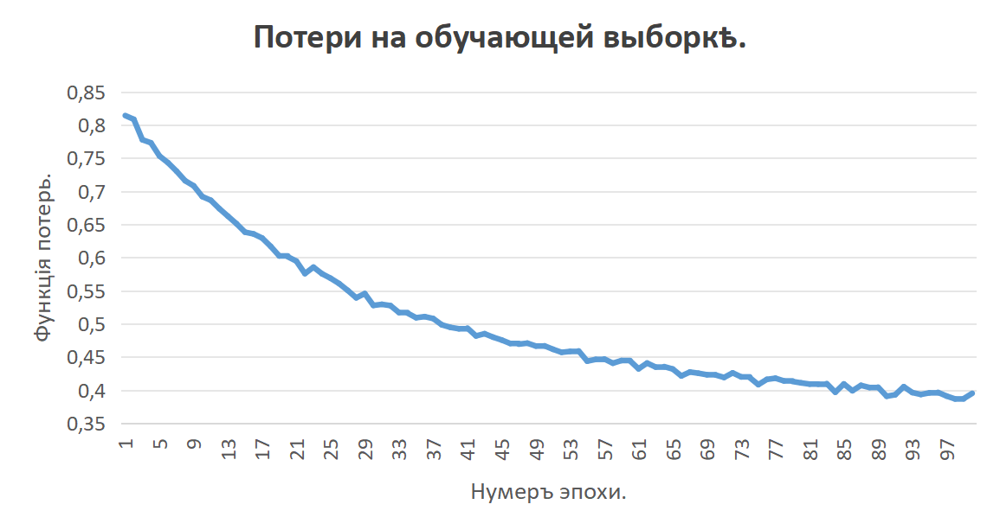
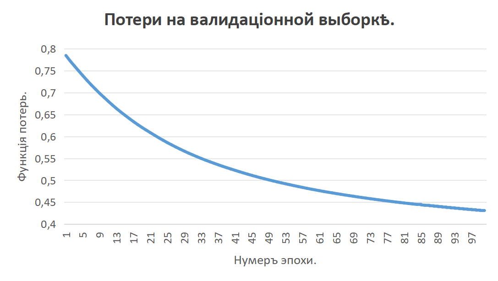
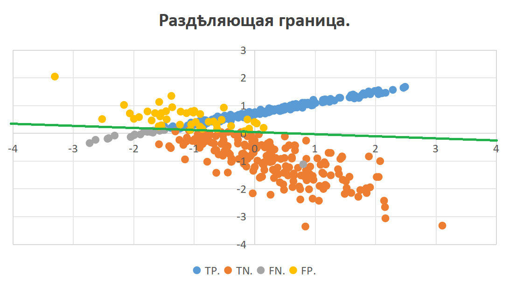
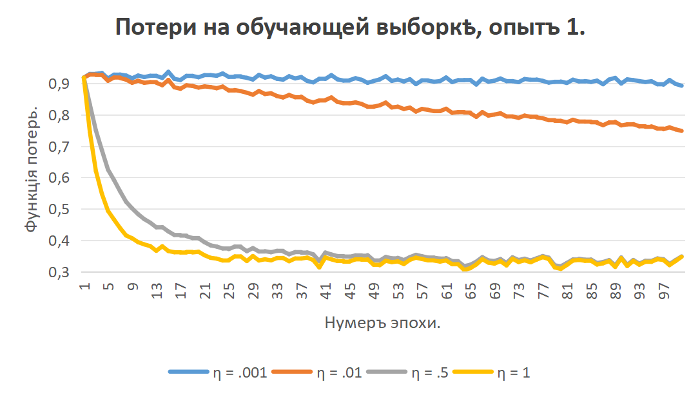
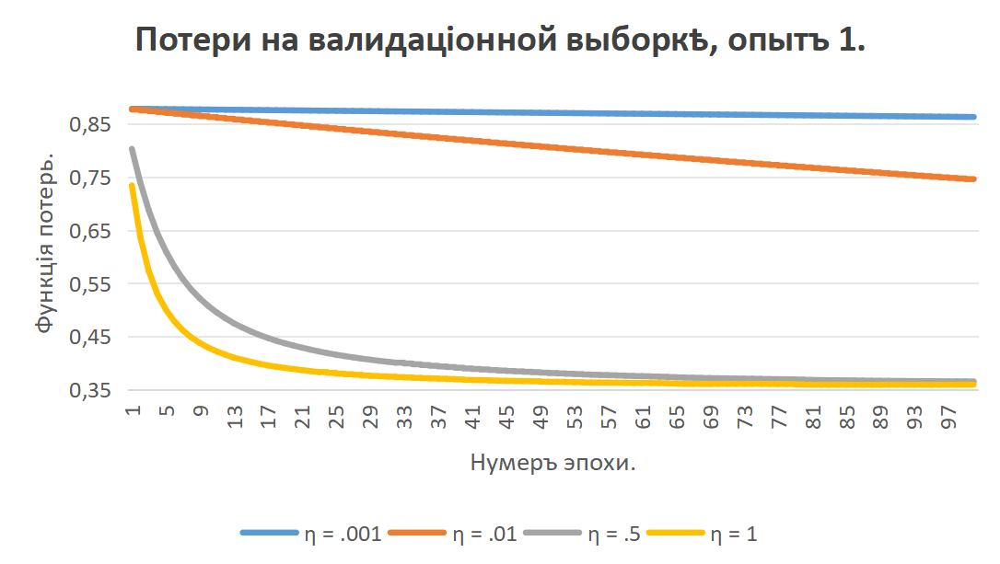
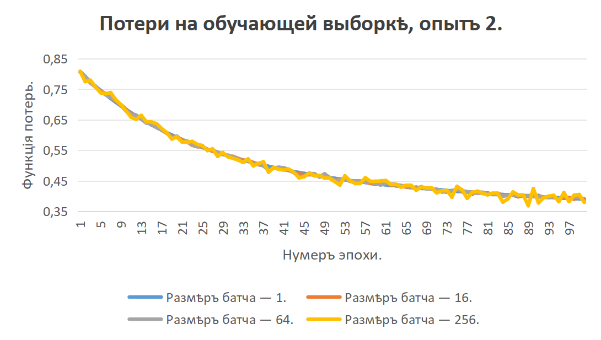
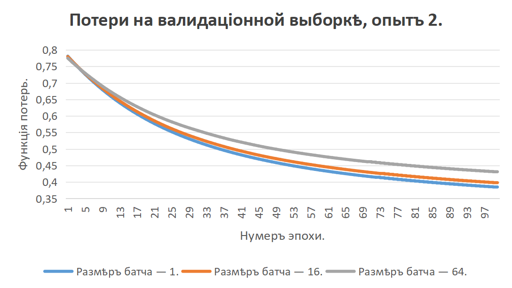
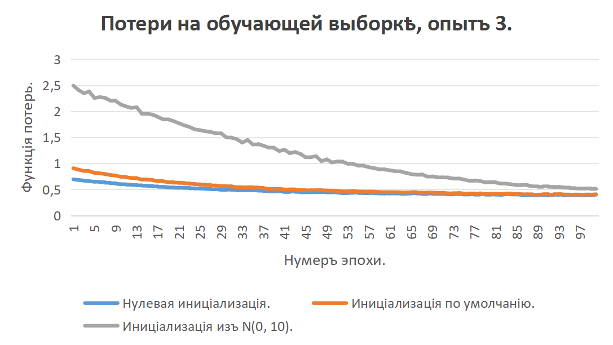
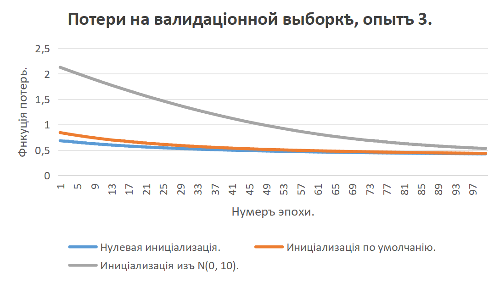

# SecondLAVM.
## Функціи перцептрона.
### Функція „sigmoid“.
Функція „sigmoid“ возвращаетъ $\frac{1}{1+e^{-x}}$, гдѣ $x$ — входное значеніе.  
Сигмоида обрѣзана: при значеніяхъ меньше -100 она даетъ $\frac{1}{1+e^{100}}$, при значеніяхъ больше 100 — $\frac{1}{1+e^{-100}}$.
### Функція „forward“.
Функція „forward“ умножаетъ вѣсы перцептрона, представленные векторомъ-строкою $w$ длинною $n$, на матрицу изъ столбцовъ-примѣровъ $X$ размѣра $n×m$. Къ предсказаніямъ въ полученномъ векторѣ-строкѣ прибавляется смѣщеніе, и далѣе они подвергаются сигмоидѣ.
### Функція „computeLoss“.
Функція „computeLoss“ принимаетъ на входъ векторы-строки ожидаемыхъ отвѣтовъ $y$ и полученныхъ предсказаній $\hat{y}$, оба длинною $m$. Потери считаются какъ $-\frac{1}{m}\sum_{i=1}^{m}[y_iln\hat y_i+(1-y_i)ln(1-\hat y_i)]$.
### Функція „fit“.
Въ функціи „fit“ въ одной эпохѣ обучающіе примѣры съ числомъ признаковъ $n$ тасуются алгоритмомъ Фишера-Йейтса и дѣлятся на батчи $X_b$ и $y_b$ размеромъ $n×m$ и $1×m$, послѣ по каждому из батчей $X_b$ вычисляются потери, производныя потерь по вѣсамъ какъ $\frac{1}{m}(\hat y_b - y_b)X^T$ и по смѣщенію какъ $\frac{1}{m}\sum_{i=1}^{m}(\hat y_{b i} - y_{b i})$. Высчитываются ихъ среднія ариѳметическія по всѣмъ батчамъ, для потерь оно записывается, а для производныхъ по вѣсамъ и по смѣщенію вычитается соотвѣтственно изъ вѣсовъ и смѣщенія съ домноженіемъ на скорость обученія.  
Оный способъ счета даетъ тотъ же самый исходъ, что и вычисленія безъ батчей, и шума при малыхъ ихъ размѣрахъ не испытываетъ.  
Дальше провѣряющіе примѣры такъ же раздѣляются на батчи и по нимъ считаются потери, среднее ариѳметическое которыхъ по всѣмъ батчамъ записывается.  
Все то же самое проводится на послѣдующихъ эпохахъ.
### Функція „predict“.
Функція „predict“ множитъ вѣсы перцептрона на поданный векторъ-столбецъ признаковъ, прибавляетъ къ полученному числу смѣщеніе и подвергает это число сигмоидѣ. Если исходъ менѣе .5, въ отвѣтъ пишется 0, если нѣтъ — 1.
## Опыты.
### Обученіе перцептрона.
При обученіи перцептрона получено такое:
  
|Доля правильныхъ отвѣтовъ на обучающей выборкѣ.|Доля правильныхъ отвѣтовъ на валидаціонной выборкѣ.|
|:---:|:---:|
|.8714285714285714|.8666666666666667|

Графикъ потерь на валидаціонной выборкѣ болѣе плавный, чѣмъ на обучающей. Перцептронъ раздѣлилъ классы примѣрно правильно, съ учетомъ его возможностей.
### Первый опытъ.
Въ первомъ опытѣ было получено:
 
|Скорость обученія.|Доля правильныхъ отвѣтовъ на обучающей выборкѣ.|Доля правильныхъ отвѣтовъ на валидаціонной выборкѣ.|
|:---:|:---:|:---:|
|.001|.2857142857142857|.2666666666666667|
|.01|.4457142857142857|.4400000000000000|
|.5|.8685714285714285|.8800000000000000|
|1|.8714285714285714|.8800000000000000|

На меньшихъ скоростяхъ перцептронъ обучается гораздо медленнѣе, а при большихъ же на обучающей выборкѣ слегка увелчивается шумъ.
### Второй опытъ.
На второмъ опытѣ получены такіе итоги (обучающая выборка при размѣрѣ батча 256 опущена, т. к. въ такомъ случаѣ батчъ больше самой выборки):
 
|Величина батча.|Доля правильныхъ отвѣтовъ на обучающей выборкѣ.|Доля правильныхъ отвѣтовъ на валидаціонной выборкѣ.|
|:---:|:---:|:---:|
|1|.8714285714285714|.8733333333333333|
|16|.8714285714285714|.8666666666666667|
|64|.8714285714285714|.8733333333333333|
|256|.8714285714285714|—|

Какъ можно замѣтить, размѣръ батча ни на что не имѣетъ дѣйствія изъ-за пути разсчета производныхъ потерь.
### Третій опытъ.
По третьему опыту вышла такая сводка:
 
|Видъ иниціализаціи.|Доля правильныхъ отвѣтовъ на обучающей выборкѣ.|Доля правильныхъ отвѣтовъ на валидаціонной выборкѣ.|
|:---:|:---:|:---:|
|Нулевая|.8657142857142858|.8666666666666667|
|По умолчанію|.8714285714285714|.8733333333333333|
|Изъ N(0, 10)|.8457142857142858|.8333333333333334|

Иниціализація большими числами изъ N(0, 10) ведетъ себя хуже остальныхъ, поскольку при умноженіи на векторъ признаковъ выходитъ увеличенное значеніе, что ухудшаетъ точность предсказанія.  
Нулевая инціализація же въ теоріи можетъ ухудшить обученіе изъ-за того, что въ началѣ для любыхъ значеній признаковъ непремѣнно даетъ одинъ и тотъ же исходъ.
